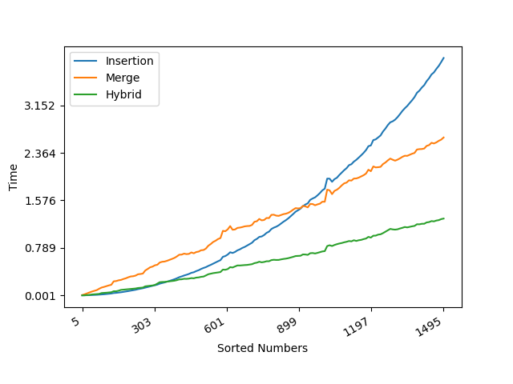
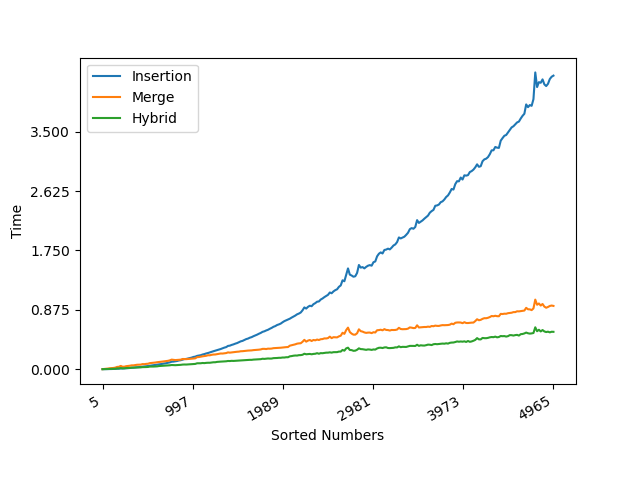

## Q1 Merge sort vs Insertion sort
1. __Hypothesis__: Given a small size of numbers, the insertion sort can be faster than the merging sort. Since the insertion sort is the in-place adaptive sorting method while the merging sort is a recursive partitioning sort. In theory, the complexity analysis for both sorts are O(n^2) and O(log(n)), respectively. Precisely, it can be 8n^2 and 64nlog(n) approximately. Thus the estimated n should be around 43 when the insertion sort starts running slower than the merging sort.

2. __Methods__: In the interest of citation and academic honesty, the source code is based on the live coding examples provided by Prof. Ofria. The github link is as follows:

https://github.com/liecn/algorithms/blob/master/CSE_830/hw4/hw4_1.cpp

- We generate the random series of numbers using the pseudo-random generator __std::mt19937__ with the real distribution __std::uniform_real_distribution__.

- We achieve the insertion sort, merging sort, and hybrid sort and output the running time for all into the __.csv__ file.

- We test different sizes of numbers for all three sorting methods. For each size, we run 100 times and compute the accumulated time as the output.

3. __Results__:

|   N=5:1500	|  N=5:5000 	|
|---	|---	|
|   	|   	|
4. __Discussion__: Different from the __Hypothesis__, the graph indicates the value on n = 900 where the lines cross (or a range of values where they essentially overlap) for both insertion sort and merging sort. The reason behind this can be the optimization measurements and adopted data structures for the implementation. For example, in merging sort, we adopted the __vector__ for insertion operation to adapt the dynamic size of the intermediate results. Besides, the __std::copy_n__ is used to extend the vector. Considering the recursive inherence of the merging sort, the aforementioned properties make it more inefficiency when dealing with the small size of numbers.

5. __Conclusions__: Under the conditions tested with the current implementation, insertion sort produces a faster algorithm for n < 850, while merging sort is faster for n > 950.  For n between 850 and 950 the two sorting methods are indistinguishable.

