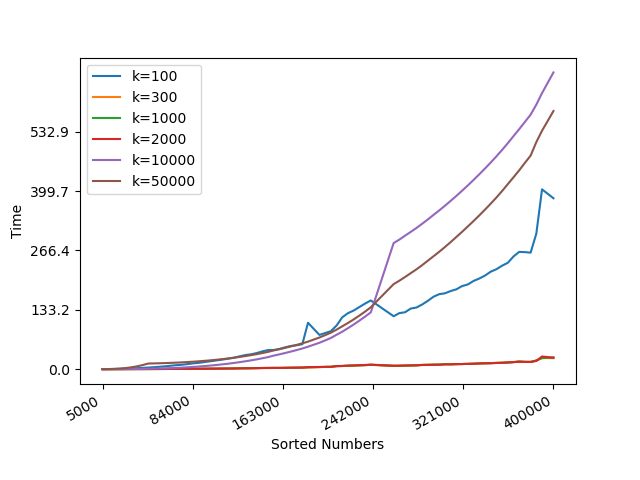

## Q3 Comparing dictionary structures
1. __Hypothesis__: The part 1 indicates the value on n = 900 where the lines cross (or a range of values where they essentially overlap) for both insertion sort and merging sort. Naturally, we should set the dividing point as 900 in the Tim sort, which should be consistent with the crossover point for part 1.

2. __Methods__: In the interest of citation and academic honesty, the source code is based on the live coding examples provided by Prof. Ofria. The github link is as follows:

- We generate the random series of numbers using the pseudo-random generator __std::mt19937__ with the real distribution __std::uniform_real_distribution__.

- We achieve the Time sort and output the running time for all into the __.csv__ file.

- We test different dividing point k and sizes of numbers. For each dividing point, we only run once while we run 100 time with different sizes of numbers. 

3. __Results__: 
### Benchmark
|   N=5:1500	|  N=5000:400000 	|
|---	|---	|
|   	|   	|

4. __Discussion__: Consistent with the __Hypothesis__, the graph indicates the Time sort is faster than both insertion sort and merging sort for most cases. And the second graph shows that when k is around 1000, it has the best results and varies slightly for k = 300 and 2000. While the k is too larger or smaller, the efficiency decreases.

5. __Conclusions__: Under the conditions tested with the current implementation, the dividing point k is almost same as the crossover point for part 1.
