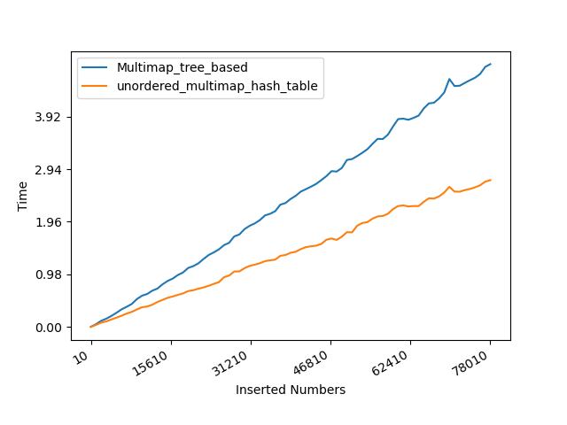

## Q3 Comparing dictionary structures
1. __Hypothesis__: In theory, the complexity analysis of the insertion operation for the hash table and binary tree are O(1) and O(log(n)), respectively. Thus the hash table should be much faster than the tree-based dictionary. The latter however produces no duplicate keys so there would be no collisions. The advantage of the tree-based dictionary is not speed but to reduce memory consumption, and to have better worst-case guarantees. I have no clue to estimate the dividing point for those two dictionaries for the running efficiency. And I guess the hash table should be faster than the tree-based container from the beginning. And it can be much faster with a larger size of numbers. Since the tree-based container spends extra time to maintain the order of the keys.

2. __Methods__: The github link is as follows:

https://github.com/liecn/algorithms/blob/master/CSE_830/hw4/hw4_3.cpp

- We generate the random series of numbers using the pseudo-random generator __std::mt19937__ with the real distribution __std::uniform_int_distribution__.

- We achieve the __std::multimap__ and __std::unordered_multimap__ and test the insertion operation.

- We test different sizes of numbers and run 100 times for each size, delivering the accumulated time as the final outputs. 

3. __Results__: 
 

4. __Discussion__: Consistent with the __Hypothesis__, the graph indicates the hash table (__std::unordered_multimap__) should be faster than the tree-based container (__std::multimap__) from the beginning.

5. __Conclusions__: Under the conditions tested with the current implementation, both dictionaries spend the linear time for the insertion operation. While the tree-based container consumes extra time to maintain the order of the stored keys for insertion.